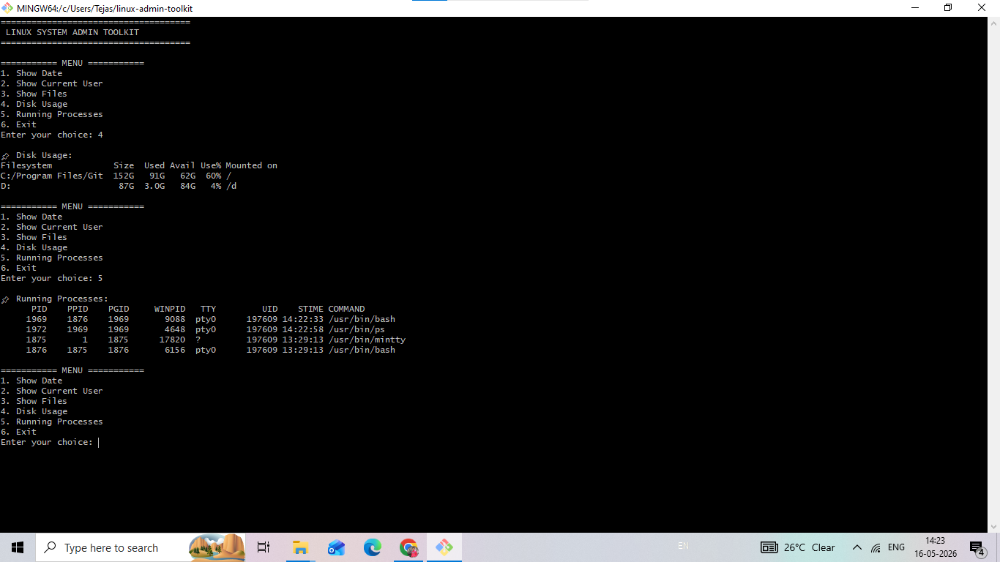

# Linux System Administration Toolkit using Bash Scripting

## 📌 Project Overview
This project is a Linux System Administration Toolkit developed using Bash Scripting.  
It provides useful Linux administration features through a menu-driven terminal interface.

The toolkit helps system administrators perform common tasks easily and efficiently.

---

## 🚀 Features

- 📅 Show Current Date
- 👤 Show Current User
- 📂 Display Files and Folders
- 💽 Check Disk Usage
- ⚙️ Show Running Processes
- 📝 Generate System Report
- 💾 Backup Script Automatically
- 🔐 Password Protection
- 🎨 Colorful Terminal Output

---

## 🛠️ Technologies Used

- Bash Scripting
- Linux Commands
- Git & GitHub

---

## 📷 Project Output
## 📸 Project Screenshot



The project runs in terminal with an interactive menu system.

---

## ▶️ How to Run

```bash
chmod +x monitor.sh
./monitor.sh

linux-admin-toolkit/
│── monitor.sh
│── backup/
│── reports/
│── README.md

## 👨‍💻 Author

Tejas Kherade
